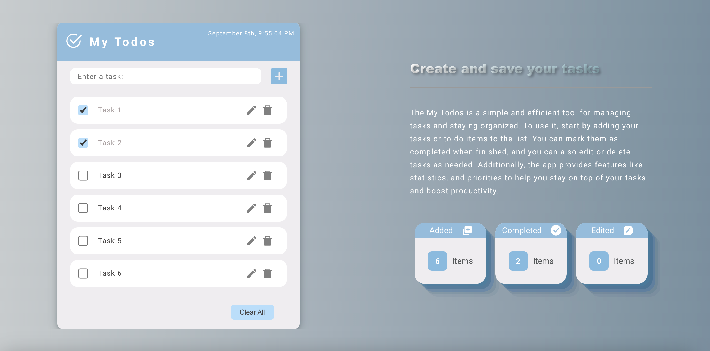

# Todo Application (React)

## 📄  Description

My Todos is a simple and efficient tool for managing tasks and staying organized. This React-based application allows users to create, edit, delete, and mark tasks as completed. It also provides statistics on added, completed, and edited tasks.

## 💻  Technologies

- React
- React Icons
- Date-fns
- CSS
- LocalStorage
- Node.js and npm

## 🖼️  Screenshots

## 🌟  Features

- Create new tasks with a user-friendly interface.
- Edit tasks by clicking the edit icon.
- Mark tasks as completed by checking the checkbox.
- Delete tasks using the delete icon.
- Clear all tasks with a single button click.
- Track the number of added, completed, and edited tasks.
- Responsive design for various screen sizes.

## 🔧  Installation

1. Clone this repository to your local machine using `git clone`.
2. Navigate to the project directory.
3. Install the project dependencies: `npm install`
4. Start the development server: `npm start`

## 📞  Contact

- Stipan Madžar
- 📧 Email: smadzar90@student.se.edu
- 💼 GitHub: [https://github.com/smadzar90](https://github.com/smadzar90)
- 💬 LinkedIn: [https://www.linkedin.com/in/stipan-madzar-b6b857225/](https://www.linkedin.com/in/stipan-madzar-b6b857225/)
